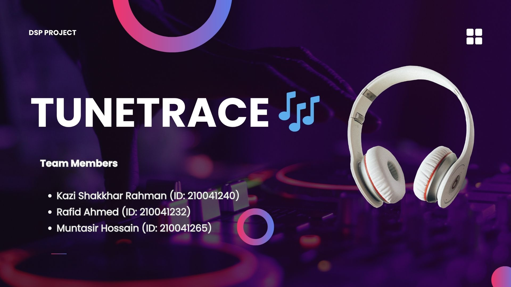
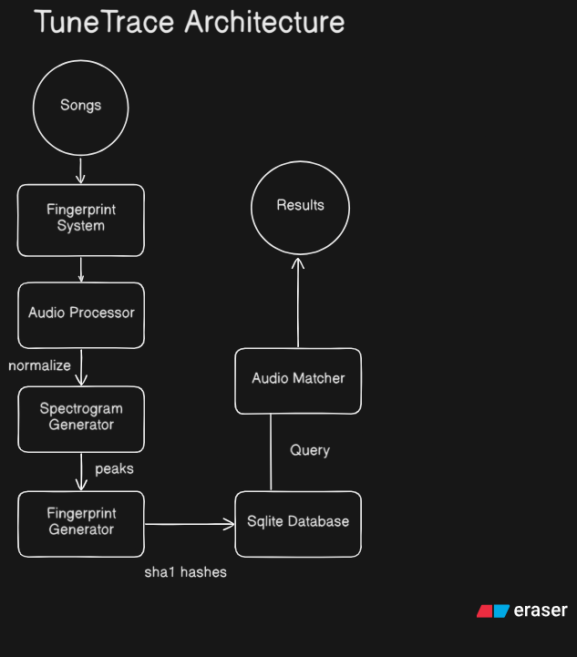

<div align="center">
  
  
  # 🎵 TuneTrace - Audio Fingerprinting & Song Identification System
  
  [](https://www.python.org/)
  [](https://streamlit.io/)
  [](https://numpy.org/)
  [](https://scipy.org/)
  [](https://www.sqlite.org/)
  
  **An advanced audio fingerprinting system for music identification using digital signal processing techniques**
  
  [📄 Full Documentation](docs/TuneTrace.pdf) • [Report Issues](https://github.com/rafidahmed816/TuneTrace/issues)
</div>

---

- [🎵 TuneTrace - Audio Fingerprinting \& Song Identification System](#-tunetrace---audio-fingerprinting--song-identification-system)
  - [🎯 Overview](#-overview)
    - [Key Capabilities](#key-capabilities)
  - [✨ Features](#-features)
    - [Core Features](#core-features)
    - [Additional Features](#additional-features)
  - [🏗️ System Architecture](#️-system-architecture)
    - [Component Description](#component-description)
  - [🔬 How It Works](#-how-it-works)
    - [1. Audio Preprocessing](#1-audio-preprocessing)
    - [2. Spectrogram Generation (STFT)](#2-spectrogram-generation-stft)
    - [3. Peak Detection](#3-peak-detection)
    - [4. Fingerprint Generation](#4-fingerprint-generation)
    - [5. Database Storage](#5-database-storage)
    - [6. Song Identification](#6-song-identification)
  - [🛠️ Technology Stack](#️-technology-stack)
    - [Core Technologies](#core-technologies)
    - [Programming Language](#programming-language)
    - [Digital Signal Processing](#digital-signal-processing)
    - [Audio I/O](#audio-io)
    - [Database](#database)
    - [Web Framework](#web-framework)
    - [Visualization](#visualization)
    - [Additional Libraries](#additional-libraries)
  - [📥 Installation](#-installation)
    - [Prerequisites](#prerequisites)
    - [Step 1: Clone the Repository](#step-1-clone-the-repository)
    - [Step 2: Install System Dependencies](#step-2-install-system-dependencies)
      - [On Linux (Ubuntu/Debian):](#on-linux-ubuntudebian)
      - [On macOS:](#on-macos)
      - [On Windows:](#on-windows)
    - [Step 3: Create Virtual Environment](#step-3-create-virtual-environment)
    - [Step 4: Install Python Dependencies](#step-4-install-python-dependencies)
    - [Step 5: Verify Installation](#step-5-verify-installation)
  - [🚀 Usage](#-usage)
    - [Running the Application](#running-the-application)
    - [Features Walkthrough](#features-walkthrough)
      - [1. Add Songs to Database](#1-add-songs-to-database)
      - [2. View Song Library](#2-view-song-library)
      - [3. Play Songs](#3-play-songs)
      - [4. Identify Songs](#4-identify-songs)
  - [📁 Project Structure](#-project-structure)
  - [🔍 Technical Details](#-technical-details)
    - [Audio Fingerprinting Algorithm](#audio-fingerprinting-algorithm)
    - [Performance Characteristics](#performance-characteristics)
    - [Matching Confidence Levels](#matching-confidence-levels)
  - [🎯 Use Cases](#-use-cases)
  - [🤝 Contributing](#-contributing)
  - [📝 Notes](#-notes)
  - [📄 License](#-license)
  - [👥 Authors](#-authors)
  - [🙏 Acknowledgments](#-acknowledgments)


## 🎯 Overview

TuneTrace is a sophisticated audio fingerprinting and song identification system inspired by services like Shazam. It uses advanced Digital Signal Processing (DSP) techniques to analyze audio files, generate unique acoustic fingerprints, and match them against a database of songs. The system can identify songs from short audio clips, recorded audio from a microphone, or uploaded files.

### Key Capabilities

- **🎵 Audio Fingerprinting**: Generate unique spectral fingerprints from audio signals
- **🔍 Song Identification**: Match audio clips against a database of songs with confidence scoring
- **🎤 Live Recording**: Record and identify songs directly from your microphone
- **📊 Spectrogram Visualization**: View time-frequency representations of audio signals
- **💾 Database Management**: SQLite-based storage for songs and fingerprints
- **🎧 Audio Playback**: Built-in audio player for songs and matched results

---

## ✨ Features

### Core Features

- **Audio Fingerprinting Engine**: Generate robust fingerprints using STFT and peak detection
- **Real-time Song Recognition**: Identify songs from uploaded files or microphone input
- **Spectrogram Analysis**: Visualize frequency content over time with peak detection
- **Confidence Scoring**: Advanced matching algorithm with alignment and confidence metrics
- **Multi-format Support**: Compatible with MP3, WAV, and other common audio formats
- **Database Integration**: Efficient SQLite database for storing and querying fingerprints
- **Web Interface**: User-friendly Streamlit-based GUI for easy interaction

### Additional Features

- **Batch Song Addition**: Add multiple songs to the database simultaneously
- **Song Library Management**: View, organize, and manage your music collection
- **Audio Playback**: Play songs directly from the application
- **Noise Handling**: Optimized for identification even with background noise
- **Fast Matching**: Optimized database queries for quick song identification

---

## 🏗️ System Architecture

TuneTrace follows a modular architecture with clear separation of concerns:

<div align="center">
  
</div>

<br>

### Component Description

1. **Main Interface (`main.py`)**: Streamlit-based web UI for user interactions
2. **Fingerprint System (`fingerprint_system.py`)**: Core orchestrator coordinating all components
3. **Audio Processor (`audio_processor.py`)**: Handles audio loading, normalization, and preprocessing
4. **Spectrogram Generator (`spectrogram_utils.py`)**: Computes STFT and generates time-frequency representations
5. **Fingerprint Generator (`fingerPrintGenerator.py`)**: Creates acoustic fingerprints from spectrogram peaks
6. **Audio Matcher (`audioMatcher.py`)**: Matches query fingerprints against the database
7. **Audio Database (`audio_database.py`)**: SQLite interface for storing and querying songs/fingerprints
8. **Microphone Recorder (`microphone_recorder.py`)**: Captures live audio from microphone

---

## 🔬 How It Works

TuneTrace employs a sophisticated audio fingerprinting pipeline based on spectral analysis:

### 1. Audio Preprocessing

```
Audio File → Load Audio → Normalize → Mono Conversion
```

- Loads audio files using `librosa` at 22050 Hz sample rate
- Normalizes amplitude to [-1, 1] range
- Converts stereo to mono for consistent processing

### 2. Spectrogram Generation (STFT)

```
Audio Signal → STFT → Time-Frequency Matrix → dB Scale
```

The system applies **Short-Time Fourier Transform (STFT)** to convert the audio signal from time domain to frequency domain:

```python
frequencies, times, Sxx = signal.spectrogram(
    audio_data,
    fs=sample_rate,
    window="hann",
    nperseg=4096,      # Window size
    noverlap=3072,     # 75% overlap
    scaling="spectrum"
)
```

**Parameters:**

- **Window Size**: 4096 samples (~185ms @ 22050 Hz)
- **Hop Size**: 1024 samples (~46ms @ 22050 Hz)
- **Window Function**: Hann window for smooth spectral estimates

### 3. Peak Detection

```
Spectrogram → Local Maxima Detection → Constellation Map
```

The system identifies prominent spectral peaks using:

- **Maximum Filtering**: Finds local maxima in 20x20 neighborhood
- **Amplitude Thresholding**: Filters peaks above -40 dB
- **Peak Coordinates**: Stores (frequency_bin, time_bin) pairs

### 4. Fingerprint Generation

```
Peaks → Anchor-Target Pairing → Hash Generation → Fingerprints
```

**Combinatorial Hashing Algorithm:**

For each anchor peak:

1. Select 5 target peaks in the future (target zone)
2. Create hash from: `anchor_freq | target_freq | time_delta`
3. Apply SHA-1 hashing for compact representation
4. Store: `(hash, anchor_time_offset)`

**Example:**

```python
hash_input = f"{anchor_freq}|{target_freq}|{time_delta}"
fingerprint_hash = hashlib.sha1(hash_input.encode()).hexdigest()
fingerprints.append((fingerprint_hash, anchor_time))
```

### 5. Database Storage

```
Fingerprints → SQLite Database → Indexed Tables
```

**Database Schema:**

```sql
-- Songs Table
CREATE TABLE songs (
    id INTEGER PRIMARY KEY,
    title TEXT,
    artist TEXT,
    genre TEXT,
    file_path TEXT,
    duration REAL,
    date_added TIMESTAMP
);

-- Fingerprints Table (indexed on hash)
CREATE TABLE fingerprints (
    id INTEGER PRIMARY KEY,
    song_id INTEGER,
    hash TEXT,
    time_offset INTEGER,
    FOREIGN KEY (song_id) REFERENCES songs(id)
);
```

### 6. Song Identification

```
Query Audio → Generate Fingerprints → Database Match → Time Alignment → Confidence Score
```

**Matching Algorithm:**

1. **Hash Matching**: Query database for matching fingerprint hashes
2. **Time Alignment**: Calculate time deltas: `Δt = db_time - query_time`
3. **Vote Counting**: Count aligned matches for each song
4. **Confidence Calculation**: `confidence = aligned_matches / total_query_fingerprints`

**Time Alignment Visualization:**

```
Database Song:    |----*---*---*---*----|
Query Clip:                   |--*--*--*--|
                              ↑
                        Time Alignment Point
                        (Most common Δt)
```

---

## 🛠️ Technology Stack

<div align="center">

### Core Technologies

| Technology                                                                                            | Purpose             | Version |
| ----------------------------------------------------------------------------------------------------- | ------------------- | ------- |
|           | Core Language       | 3.8+    |
|              | Numerical Computing | Latest  |
|              | Signal Processing   | Latest  |
|  | Web Interface       | Latest  |
|           | Database            | 3.x     |

</div>

### Programming Language

- **Python 3.8+**: Core language for audio processing and web application

### Digital Signal Processing

- **NumPy**: Numerical computations and array operations
- **SciPy**: Signal processing (STFT, spectrogram generation)
- **Librosa**: Audio loading and analysis

### Audio I/O

- **SoundDevice**: Real-time audio playback and recording
- **CFFI**: Foreign Function Interface for PortAudio bindings

### Database

- **SQLite3**: Lightweight embedded database for songs and fingerprints

### Web Framework

- **Streamlit**: Interactive web interface for the application

### Visualization

- **Matplotlib**: Spectrogram visualization and plotting

### Additional Libraries

- **Pandas**: Data manipulation for song library display
- **Hashlib**: SHA-1 hashing for fingerprint generation

---

## 📥 Installation

### Prerequisites

- **Python 3.8 or higher**
- **Git**
- **PortAudio** (for audio recording/playback)
- **FFmpeg** (for MP3 and other audio format support)

### Step 1: Clone the Repository

```bash
git clone https://github.com/rafidahmed816/TuneTrace.git
cd TuneTrace
```

### Step 2: Install System Dependencies

#### On Linux (Ubuntu/Debian):

```bash
sudo apt-get update
sudo apt-get install libportaudio2 portaudio19-dev ffmpeg
```

#### On macOS:

```bash
brew install portaudio ffmpeg
```

#### On Windows:

**PortAudio:**

- PortAudio is typically bundled with the Python packages. If you encounter issues:
  1. Download PortAudio from [http://www.portaudio.com/](http://www.portaudio.com/)
  2. Install it to your system

**FFmpeg:**

1. Download FFmpeg from [https://ffmpeg.org/download.html](https://ffmpeg.org/download.html)
2. Extract the archive and add the `bin` folder to your system PATH
3. Or use Chocolatey: `choco install ffmpeg`

**Verify FFmpeg installation:**

```bash
ffmpeg -version
```

### Step 3: Create Virtual Environment

```bash
# Create virtual environment
python3 -m venv venv

# Activate virtual environment
# On Linux/macOS:
source venv/bin/activate

# On Windows:
.\venv\Scripts\activate
```

### Step 4: Install Python Dependencies

```bash
pip install -r requirements.txt
```

**Required Packages:**

- streamlit
- librosa
- sounddevice
- cffi>=1.0
- matplotlib
- numpy
- scipy
- pandas

### Step 5: Verify Installation

```bash
python -c "import streamlit, librosa, sounddevice; print('All dependencies installed successfully!')"
```

---

## 🚀 Usage

### Running the Application

1. **Activate your virtual environment:**

```bash
# On Linux/macOS:
source venv/bin/activate

# On Windows:
.\venv\Scripts\activate
```

2. **Start the Streamlit app:**

```bash
streamlit run main.py
```

3. **Access the web interface:**

The app will automatically open in your default browser at:

```
http://localhost:8501
```

### Features Walkthrough

#### 1. Add Songs to Database

1. Navigate to **"Add Song"** from the sidebar
2. Upload an audio file (MP3 or WAV)
3. Enter song title and artist name
4. Select genre
5. Click **"Save Song"**
6. View the generated spectrogram with detected peaks

#### 2. View Song Library

1. Navigate to **"Show Songs"**
2. Browse your song collection in a table format
3. View song details: title, artist, genre, duration, date added

#### 3. Play Songs

1. Navigate to **"Play Song"**
2. Select a song from the dropdown
3. Click **"▶️ Play"** to listen

#### 4. Identify Songs

**Option A: Upload Audio File**

1. Navigate to **"Identify Song"**
2. Upload a short audio clip (5-30 seconds)
3. Click **"🔍 Identify Song"**
4. View match results with confidence scores
5. Play the matched song if found

**Option B: Record from Microphone**

1. Navigate to **"Identify Song"**
2. Select recording duration (5-30 seconds)
3. Click **"🎤 Start Recording"**
4. System automatically identifies the song
5. View match results immediately

---

## 📁 Project Structure

```
TuneTrace/
│
├── docs/
│   ├── TuneTrace.pdf           # Project presentation
│   └── TuneTrace.jpg           # Banner image
│
├── songs/                       # Directory for song files
│   └── [audio files]
│
├── main.py                      # Streamlit web application
├── fingerprint_system.py        # Core fingerprinting system
├── audio_processor.py           # Audio loading & preprocessing
├── audio_database.py            # SQLite database interface
├── audioMatcher.py              # Fingerprint matching engine
├── fingerPrintGenerator.py      # Fingerprint generation
├── spectrogram_utils.py         # Spectrogram & peak detection
├── microphone_recorder.py       # Audio recording from mic
│
├── requirements.txt             # Python dependencies
├── README.md                    # This file
├── LICENSE                      # Project license
│
└── songs.db                     # SQLite database (auto-generated)
```

---

## 🔍 Technical Details

### Audio Fingerprinting Algorithm

TuneTrace implements a **constellation-based** audio fingerprinting algorithm similar to the Shazam approach:

1. **Robustness**: Resistant to noise, compression artifacts, and audio distortions
2. **Efficiency**: Fast fingerprint generation and matching
3. **Scalability**: Handles large song databases with indexed searches
4. **Accuracy**: High identification accuracy even with short clips

### Performance Characteristics

- **Fingerprint Generation**: ~1-2 seconds per 3-minute song
- **Database Insertion**: ~0.5 seconds for typical song
- **Query Matching**: ~0.1-0.5 seconds per query
- **Memory Usage**: ~1-2 MB per song (fingerprints only)

### Matching Confidence Levels

- **>70%**: Excellent match - Very high confidence
- **40-70%**: Good match - High confidence
- **<40%**: Possible match - Lower confidence

---

## 🎯 Use Cases

- **Music Identification**: Identify unknown songs from audio clips
- **Copyright Detection**: Find copyrighted content in media
- **Duplicate Detection**: Identify duplicate songs in large collections
- **Music Research**: Study acoustic patterns and similarities
- **DJ Tools**: Quick song identification in live settings

---

## 🤝 Contributing

Contributions are welcome! Please feel free to submit a Pull Request.

1. Fork the repository
2. Create your feature branch (`git checkout -b feature/AmazingFeature`)
3. Commit your changes (`git commit -m 'Add some AmazingFeature'`)
4. Push to the branch (`git push origin feature/AmazingFeature`)
5. Open a Pull Request

---

## 📝 Notes

- For best results, use audio files in **WAV or MP3 format** with a consistent sample rate
- The SQLite database (`songs.db`) is generated automatically on first run
- Large audio files may take longer to process
- Currently, only mono/single-channel audio is fully supported
- Recording requires a working microphone and PortAudio installation

---

## 📄 License

This project is licensed under the MIT License - see the [LICENSE](LICENSE) file for details.

---

## 👥 Authors

- **Rafid Ahmed** - [rafidahmed816](https://github.com/rafidahmed816)

---

## 🙏 Acknowledgments

- Inspired by Shazam's audio fingerprinting algorithm
- Built with Python and modern DSP libraries
- Uses Streamlit for the web interface
- Based on spectral peak extraction techniques from audio analysis research

---
